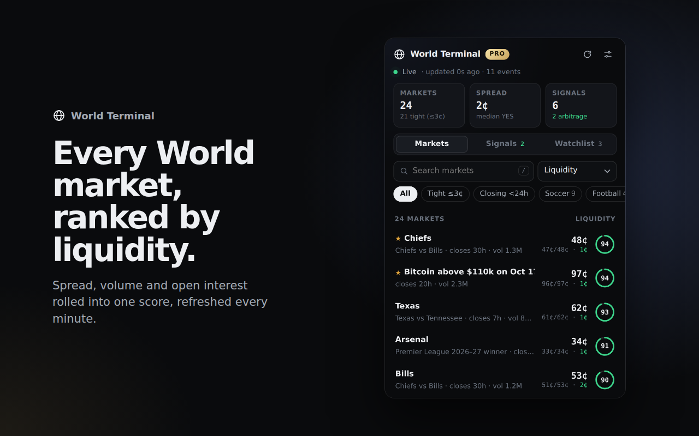
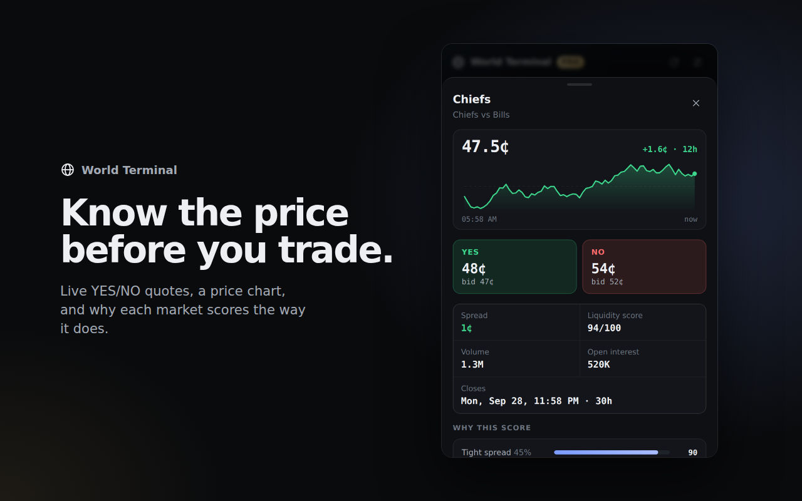
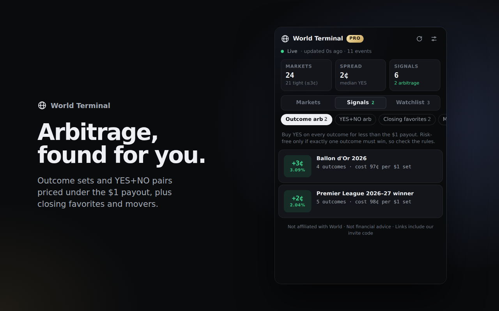

# World Terminal — Chrome extension for world.xyz

A market terminal for [World](https://world.xyz), the Solana prediction market. It shows which markets are liquid, flags pricing opportunities, and sends price alerts. **Pro features unlock for free when a user joins World through your invite link.**





_Screenshots use sample data (`scripts/sample-data.mjs`), not live World prices._

## Features

| | Free | Pro (joined via your invite) |
|---|---|---|
| Live header: markets tracked, median spread, signal count | ✓ | ✓ |
| Market scanner: liquidity score ring, YES price, bid/ask, spread, volume, closing time | Top 10 | All markets |
| Sort (liquidity, spread, volume, OI, closing) · category and quick filters · search | ✓ | ✓ |
| Market detail: 12h price chart, YES/NO book, stats, score breakdown | ✓ | ✓ |
| Signals: outcome arbitrage, YES+NO arbitrage, closing favorites, movers | Blurred count | ✓ |
| Watchlist and YES/NO price alerts (desktop notifications) | | ✓ |
| New-arbitrage notifications and toolbar badge count | | ✓ |
| Stats panel on world.xyz event pages | Unlock prompt | ✓ |
| Settings: refresh rate, notifications, signal thresholds | ✓ | ✓ |

Also: a welcome page on install, side panel mode, keyboard shortcuts (`Alt+W` opens it, `/` search, `↑↓` + `Enter`, `R` refresh, `Esc` close).

Every "Trade on World" link opens `https://world.xyz/event/<ticker>?ref=<YOUR_CODE>`.

## Publishing

1. Set `REFERRAL_CODE` in `src/config.js` and test with live World data and a real wallet.
2. `npm run package` builds `world-terminal.zip`.
3. In the [Chrome Web Store dashboard](https://chrome.google.com/webstore/devconsole) ($5 one-time account), upload the zip and paste the fields from [`store/listing.md`](store/listing.md).
4. Use the 1280×800 images in `store/screenshots/` and host [`PRIVACY.md`](PRIVACY.md) for the privacy policy URL.

## Setup

1. Get your invite code: on world.xyz open your profile, then **Invite Friends**, then copy the link `https://world.xyz/?ref=XXXXXXXX`. The code is the 8-character `XXXXXXXX` part.
2. Put it in `src/config.js`:
   ```js
   REFERRAL_CODE: "XXXXXXXX",
   REFERRER_WALLET: "<your World wallet address>", // optional, see below
   ```
3. Load it: go to `chrome://extensions`, turn on Developer mode, click **Load unpacked**, and pick this folder.
4. Open world.xyz in a tab once. The extension picks up that tab's World session and starts loading data.

Other commands:

```
npm test              # unit tests for the analytics engine
npm run screenshots   # load the extension with sample data, capture every screen + store images
npm run icons         # regenerate icons/
npm run package       # build world-terminal.zip for the Chrome Web Store
```

## System design

```
┌──────────────── world.xyz tab ────────────────┐
│ content/world.js                              │
│  • reads the TURNSTILE_JWT world.xyz stored   │──setToken──┐
│  • overlay on /event/<ticker> pages           │            │
└───────────────────────────────────────────────┘            ▼
                                             ┌──────── background.js (service worker) ────────┐
 markets-api-proxy.world-xyz.workers.dev ◄───│ alarm every 1 min → GET /events?status=active   │
   /api/v1/events?withNestedMarkets=true     │ lib/analytics.js → rows, opportunities, movers  │
                                             │ evaluate alerts → chrome.notifications          │
 users-api.world.xyz ◄───────────────────────│ GET /users/<wallet>/referral → unlock check     │
   /api/v1/users/<wallet>/referral           │ writes chrome.storage.local                     │
                                             └───────────────┬─────────────────────────────────┘
                                                             │ storage.onChanged
                                             ┌───────────────▼─────────────┐
                                             │ ui/app.html (popup + side   │
                                             │ panel): Markets · Opps ·    │
                                             │ Watchlist · Unlock          │
                                             └─────────────────────────────┘
```

**Data source.** World's frontend reads from `markets-api-proxy.world-xyz.workers.dev/api/v1`, and so does the extension. That API accepts a JWT that world.xyz issues after a Cloudflare Turnstile check. The extension doesn't solve Turnstile. It reuses the token the user's own world.xyz tab already holds, which lasts about 23 hours. When the token expires, the extension asks the user to open world.xyz again. This API is **unofficial and undocumented**, so field names or authentication can change without notice. All parsing is in `src/lib/api.js` and `src/lib/analytics.js`.

**Liquidity score (0–100).** 45% spread tightness (a 10¢+ spread scores 0), 30% traded volume, and 25% open interest. Volume and OI are log-scaled and cap at 1M contracts. World fills trades against market makers rather than a public order book, so the quoted spread is the best measure of what it costs to get in and out.

**Opportunities**
- *Arb: outcomes.* The event has 3 or more outcomes and ΣYES ask < $1. This is risk-free only if the outcomes are mutually exclusive and exhaustive, and World doesn't expose a flag for that, so the UI tells users to read the rules.
- *Arb: YES+NO.* YES ask + NO ask < $1 on the same market.
- *Closing favorites.* A side priced 85–98.5¢ that closes within 48h, ranked by return per hour.
- *Movers.* Mid-price change of 5¢ or more against a snapshot from about an hour earlier. Snapshots are taken every 10 minutes and kept for 3 hours.

## How the invite unlock works

World's own invite flow, taken from world.xyz's frontend:
1. Someone opens `world.xyz/?ref=CODE`. World saves the code in that tab's `sessionStorage`.
2. After they connect a wallet, World shows **"Confirm your invite"**, and they sign `World Referral\nI am claiming referral code CODE with wallet WALLET`.
3. World stores it, and after that `GET users-api.world.xyz/api/v1/users/<wallet>/referral` returns `referredBy`.

The extension's Unlock tab walks users through these steps and then checks `referredBy` against your `REFERRAL_CODE` or `REFERRER_WALLET`. It accepts either because the API may return the referrer's wallet instead of the code. Unlocks are re-checked every 24h, and a network error never re-locks a user.

**What the extension deliberately does not do:** rewrite links on world.xyz, replace a `?ref=` code a user arrived with, write to World's `sessionStorage`, or sign anything for the user. World only counts a referral after the user signs, so silently swapping codes wouldn't earn anything. Chrome Web Store policy also bans undisclosed affiliate-code injection, and extensions that do it get removed. The popup footer discloses that links carry your invite code.

**Limits to know about**
- Users who already joined World through someone else's invite can't unlock Pro, because World allows one invite per wallet. If you'd rather keep them, add a paid or "share your own invite" tier later.
- The gate is enforced in the extension's own code. Someone who edits the unpacked source can bypass it. To make it hard to bypass, move the Pro data behind your own backend that checks the referral server-side.

## Roadmap
1. **Your own backend** (e.g. a Cloudflare Worker): one shared poller instead of one per user, server-side Pro gating, longer price history, and a leaderboard of invites.
2. **Live prices** over World's WebSocket (`wss://markets-api-proxy.world-xyz.workers.dev/api/v1/ws`) instead of 1-minute polling.
3. **Portfolio view**: the user's positions, P&L, and exit-liquidity warnings for positions in thin markets.
4. **Cross-venue edge**: compare World prices with Kalshi and Polymarket for the same event.
5. **Growth loops**: shareable "opportunity cards" with your invite link, and Telegram or Discord alert bots that link back to the extension.

## Project layout

```
manifest.json              MV3 manifest
src/config.js              invite code, default settings, API bases
src/background.js          polling, signals, alerts, badge, unlock verification
src/lib/api.js             World API client
src/lib/analytics.js       liquidity score, opportunity finders, history (pure, unit tested)
src/content/world.js       token bridge + stats panel on world.xyz event pages
src/ui/theme.css           shared design tokens
src/ui/app.*               popup / side panel (markets, signals, watchlist, sheets)
src/ui/welcome.*           first-run onboarding page
scripts/                   icons, sample data, screenshot generator
store/                     Chrome Web Store listing text and screenshots
test/                      node:test suite
```

*Not affiliated with World. Nothing here is financial advice.*
